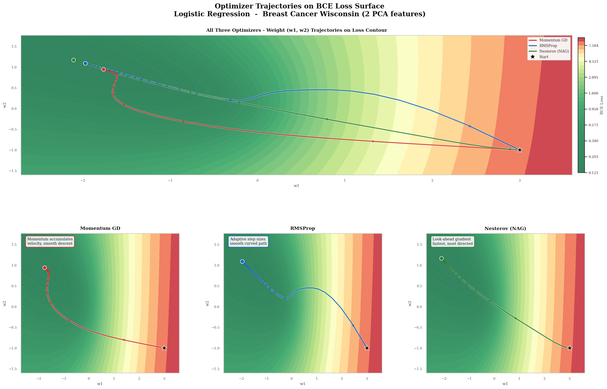

# Gradient Descent Optimizer Comparison

Comparing **Momentum GD**, **RMSProp**, and **Nesterov Accelerated Gradient (NAG)** implemented from scratch in NumPy — visualized on a real loss surface.

> Binary classification on the Breast Cancer Wisconsin dataset using Logistic Regression, with weights reduced to 2D via PCA so every step can be plotted directly on the loss contour.

---

## Contour Trajectories



All three optimizers start from the same point `w = (3, -1)` (★) in the high-loss region (red) and navigate toward the global minimum (dark green). The plots show how each optimizer's update rule produces a distinctly different path shape.

---

## Results

| Optimizer | Final Loss | Final Accuracy | lr | Key Behaviour |
|---|---|---|---|---|
| Momentum GD | 0.1239 | 95.3% | 0.07 | Accumulates velocity, smooth descent |
| RMSProp | 0.1216 | 95.6% | 0.06 | Adaptive per-param step sizes |
| Nesterov NAG | **0.1210** | **95.6%** | 0.05 | Look-ahead gradient, most directed |

---

## What's Implemented

All three optimizers are written from scratch using NumPy

### Momentum GD
```
v  ← β·v + (1−β)·g
w  ← w − α·v
```
Exponential moving average of gradients builds up velocity in consistent directions. Faster than plain GD but can overshoot on steep surfaces.

### RMSProp
```
s  ← ρ·s + (1−ρ)·g²
w  ← w − (α / √(s + ε)) · g
```
Adapts the learning rate per parameter based on recent gradient magnitudes. Large gradients shrink the effective step; small gradients grow it. Well-suited for ill-conditioned loss surfaces.

### Nesterov NAG
```
w̃  ← w − β·v          (look-ahead)
g̃  ← ∇L(w̃)            (gradient at look-ahead)
v  ← β·v + g̃
w  ← w − α·v
```
Computes the gradient where the optimizer *will be* rather than where it currently is. Reduces overshoot compared to standard Momentum and produces the most directed trajectory.

---

## Dataset

- **Breast Cancer Wisconsin** (UCI / scikit-learn)
- 569 samples, 30 features → reduced to **2 via PCA** (63.2% variance retained)
- Binary labels: 0 = malignant, 1 = benign
- Features standardized with `StandardScaler` before PCA

---

## Project Structure

```
.
├── optimizer_final_implementation.py       # All code: data, model, optimizers, plots
├── contour_trajectories_fixed.png  # Loss surface + trajectory plots
├── README.md
```

---

## How to Run

```bash
pip install numpy scikit-learn matplotlib seaborn
python optimizer_final_fixed.py
```
